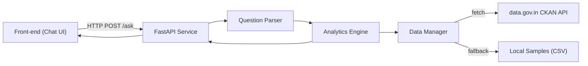

## Components

### Frontend
- Static HTML/JS, no build toolchain.
- Renders answers, tables, and citations from API responses.

### FastAPI Service
- `/ask` orchestrates parsing, analytics, and response formatting.
- `/refresh` reloads datasets (invoked after new downloads).

### Question Parser
- Regex-driven templates optimised for the challenge prompts.
- Returns structured params (states, crops, year window, etc.) to avoid brittle free-form SQL generation.

### Analytics Engine
- Pandas-based joins and aggregations.
- Computes statistics (averages, growth rates, Pearson correlation) and builds tabular payloads.
- Guarantees citation propagation for transparency.

### Data Manager
- Encapsulates API retrieval, pagination, snapshotting, and CSV fallbacks.
- Normalises column names and ensures numeric types.

### Storage
- `data/raw` – JSON snapshots of API responses (timestamped).
- `data/` – Curated CSV seeds for offline demos or tests.
- DuckDB is available for future optimisation but not required for this minimal prototype.
